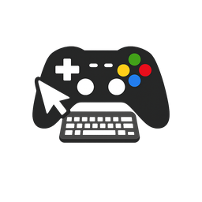

<p align="center">
  
</p>

# Gamepad Mouse

Native macOS app that drives the system pointer from a Bluetooth or USB gamepad using Apple’s Game Controller framework and synthetic `CGEvent` input. Pair an Xbox, PlayStation, or other extended gamepad, grant **Accessibility**, then move the cursor with the left stick, scroll with the right stick, and click with face buttons.

**Requirements:** macOS **12 (Monterey)** or later. **Xcode 14+** only if you are [building from source](#building-from-source).

**Where to enable Accessibility / Bluetooth:** On **macOS 13+**, use **System Settings** (Privacy & Security → Accessibility; Bluetooth in the sidebar). On **macOS 12**, use **System Preferences** → **Security & Privacy** → **Privacy** → Accessibility (and **Bluetooth** in System Preferences).

## Quick install

A pre-built universal **Release** app (`x86_64` + `arm64`) is checked in at **`dist/GamepadMouse.app`**.

1. **Clone** this repository or **download the ZIP** (**Code** → **Download ZIP** on GitHub) and expand it.
2. Copy **`dist/GamepadMouse.app`** into **`/Applications`** (drag in Finder or duplicate the folder).
3. Open **Gamepad Mouse** from Applications. If Gatekeeper complains about an unidentified developer, **right-click the app → Open** the first time and confirm.
4. Grant **Accessibility** (see above): unlock, enable **Gamepad Mouse**, then quit and reopen the app if macOS asks you to.
5. Pair your gamepad (Bluetooth or USB) and turn on **Enable mouse control** in the app. Use the **Test** tab to verify clicks and scrolling.

You do **not** need Xcode for this path.

## Building from source

Use this when you want to change the code or produce your own `.app` without using the checked-in `dist` build.

1. Open **`GamepadMouse.xcodeproj`** in Xcode, select the **GamepadMouse** scheme and **My Mac**, then **Run** (⌘R) for a Debug build.
2. For a **universal Release** binary (Intel + Apple Silicon in one executable), build for **generic macOS** from an Apple Silicon Mac, or use **Product → Archive** and **Distribute App → Copy App**.

### Command-line Release build (universal binary)

From the repo root on an Apple Silicon Mac:

```bash
xcodebuild -project GamepadMouse.xcodeproj -scheme GamepadMouse -configuration Release \
  -destination 'generic/platform=macOS' build
```

The app bundle lands under Xcode **DerivedData** (`Build/Products/Release/`), or **Product → Show Build Folder in Finder** after an archive. Confirm both CPU slices:

```bash
lipo -archs "path/to/GamepadMouse.app/Contents/MacOS/GamepadMouse"
# expect: x86_64 arm64
```

**Debug** builds on Apple Silicon are often **arm64-only** (`ONLY_ACTIVE_ARCH`); use **Release** + **generic** (or Archive) when you need a single file that runs on Intel Macs too.

## Background control

**Using another app while controlling the Mac:** The app sets **`GCController.shouldMonitorBackgroundEvents = true`** so the Game Controller framework keeps delivering stick and button updates when Gamepad Mouse is not the frontmost app (Apple changed the default to `false` in macOS 11.3). Keep **Enable mouse control** on; the window can stay in the background. A **user-initiated** activity also reduces **App Nap** throttling on the poll timer.

If control still stops when you switch apps on a **recent macOS point release**, check [Apple Developer Forums — Game Controller](https://developer.apple.com/forums/tags/game-controller) for regressions; some Sonoma/Sequoia updates have affected background controller delivery.

### Accessibility broke after rebuilding in Xcode?

macOS matches Accessibility to the app’s **code signature**, not just its name. **Debug builds** that use ad hoc signing (“Sign to Run Locally”) get a **new signature whenever the binary changes**, so the old toggle no longer applies.

**Fix:** Open **Privacy → Accessibility** (see requirements for the path on your macOS version) → unlock → remove **every** “Gamepad Mouse” row (−) → run the app again from Xcode (⌘R) → turn **on** the new entry.

Optional reset from Terminal (then grant again when prompted):

```bash
tccutil reset Accessibility com.gamepadmouse.GamepadMouse
```

**Longer-term:** In Xcode, set **Signing & Capabilities** to your **Apple Development** team instead of ad hoc only; that keeps identity more stable for day-to-day development (you may still need to re-approve after large changes).

## Distribution and signing

The **Quick install** app in **`dist/`** is built the same way as a local Release but uses ad hoc signing (“Sign to Run Locally”). For sharing beyond “download the repo,” prefer one of the following:

1. In Xcode: **Product → Archive**, then **Distribute App** → **Copy App** (or export a **Developer ID** signed build for wider distribution).
2. Zip `GamepadMouse.app` or place it in `/Applications` on the target machine.
3. For **Developer ID + notarization**, set your **team** in the target’s **Signing & Capabilities**, keep **Hardened Runtime** enabled (already on for this target), archive, then notarize with Apple’s `notarytool` so Gatekeeper does not block the app on other Macs.
4. Ad hoc or personal-team builds may require **right-click → Open** the first time on another computer.

**App Sandbox is disabled** so the app can post global mouse events; it is not suitable for the Mac App Store as-is.

## Default controls (Xbox / PlayStation)

Apple maps both families to the same **extended gamepad** layout: **A** is the south face button (A on Xbox, Cross on PlayStation), **B** east, **X** west, **Y** north.

| Input        | Action              |
|-------------|---------------------|
| Left stick  | Move pointer        |
| L3 (stick click) | Show/hide floating **virtual keyboard** |
| Right stick | Scroll (X / Y)      |
| A           | Left click          |
| B           | Right click         |
| X           | Middle click        |

Adjust **Pointer sensitivity**, **Scroll speed**, and **Stick deadzone** on the Control tab.

### Virtual keyboard (Chrome, other apps)

Turn on **Auto-show keyboard when a text field is focused** to open a **floating panel** when the focused UI is a normal text field, search field, or combo box in **any app** (same Accessibility permission as mouse control). **Secure password fields are skipped.** Typed characters are injected with **`CGEvent` Unicode key events**, like a hardware keyboard.

You can always press **L3** (left stick click) to toggle the panel. The panel is a **non-activating** window so it stays out of the way of the app you are typing into.

## Bluetooth and wireless discovery

Wireless controllers should be paired in **Bluetooth** (System Settings or System Preferences) first. Use **Search for wireless controllers** inside the app if a pad does not appear; discovery ends automatically when finished.

## Troubleshooting

- **Pointer does not move:** Confirm Accessibility is enabled for Gamepad Mouse and that **Enable mouse control** is on.
- **No controller in the list:** Connect via USB or Bluetooth; press a button on the pad so it wakes; try **Search for wireless controllers** again.
- **Laggy pointer on an older Mac, but the same controller is smooth in games/emulators:** That is usually **not** “Bluetooth Classic vs Bluetooth LE.” Games read the pad inside their render/input loop; this app polls on the main thread and (until tuned) could refresh SwiftUI and query every display on every move. Prefer a **USB cable** if you want to rule out radio congestion, but expect the bigger win from **closing the Gamepad Mouse window** or staying on a light view so the UI is not redrawing constantly, and from **Release** builds (Debug is heavier). Recent builds merge timers and avoid pointless UI updates while the stick is held.
- **Elite paddles:** This version uses the standard extended profile only; paddles may not map unless exposed by the system as extra elements.
